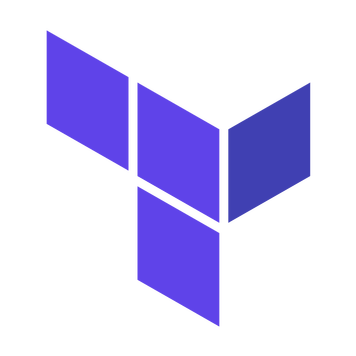
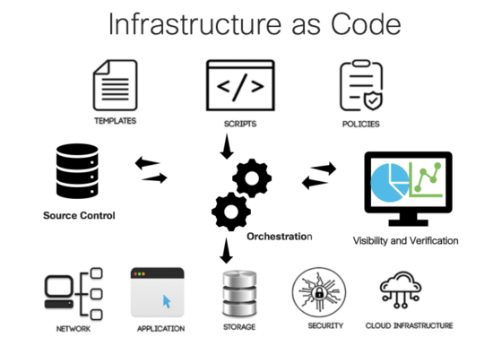
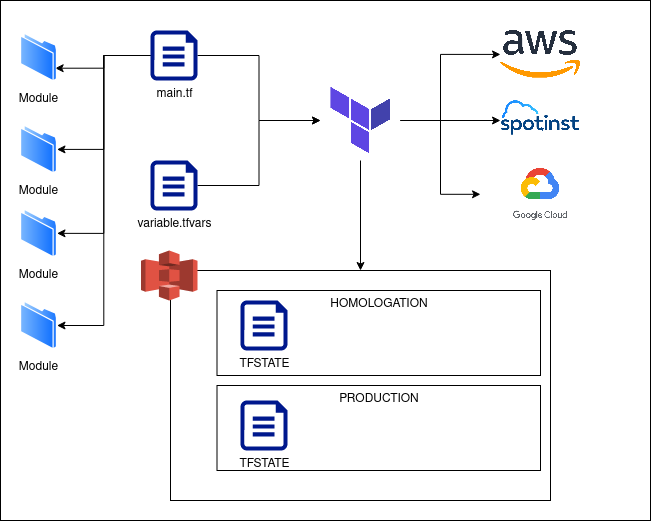

# Terraform 101 



## Links

**Documentação**

* [terraform.io](https://www.terraform.io/)
* [learn-terraform](https://learn.hashicorp.com/terraform)

**cursos**

* [Alura - infraestrutura-como-codigo](https://cursos.alura.com.br/category/infraestrutura#infraestrutura-como-codigo)
* [Alura - terraform](https://cursos.alura.com.br/course/terraform)
* [Linuxacademy - Managing Applications and Infrastructure with Terraform](https://linuxacademy.com/cp/modules/view/id/175)

## Generate apresentation

```sh
docker run -v $PWD:/src afonsoaugusto/markdown-to-slides \
    README.md -d -o presentation.html; \
    chown :$USER presentation.html
rm -rf presentation.html
```

## Agenda

* Fundamentos de IaC
* Terraform Basics
  * Variaveis
  * Outupts
  * Funções
* Providers
* Resources
* Data
* Modulos
* Locals
* Workspaces
* Backend - TFSTATE
  * Estrutura do bucket s3 utilizado
* Tarraform CLI (apply, destroy, state, , taint, import)
* Terraform Best Pratices

## Fundamentos de IaC

### Infrastructure as Code

[Infraestrutura como código](https://pt.wikipedia.org/wiki/Infraestrutura_como_C%C3%B3digo) (em inglês: infrastructure as code, ou IaC) é o processo de gerenciamento e provisionamento de [centros de processamentos dados](https://pt.wikipedia.org/wiki/Centro_de_processamento_de_dados) usando [arquivos](https://pt.wikipedia.org/wiki/Arquivo_de_computador) de configuração ao invés de configurações físicas de hardware ou [ferramentas de configuração interativas](https://pt.wikipedia.org/wiki/Interface_gr%C3%A1fica_do_utilizador).

### IaC



### [Dry - Don't repeat yourself](https://en.wikipedia.org/wiki/Don%27t_repeat_yourself)

Quando dizemos “como código”, queremos dizer que todas as boas práticas que aprendemos no mundo do software devem ser aplicadas à infraestrutura.

Uso do controle de versão, adesão ao princípio DRY, modularização, manutenção e uso de testes e implantação automatizados são práticas fundamentais.

* [technology-radar-vol-22-pt](https://assets.thoughtworks.com/assets/technology-radar-vol-22-pt.pdf)

### [Casos de Uso](https://www.terraform.io/intro/use-cases.html)

* Heroku App Setup
* Multi-Tier Applications
* Self-Service Clusters
* Multi-Cloud Deployment

## Terraform

### Terraform-1

Terraform é uma ferramenta open source de **provisionamento** de infraestrutura, criada pela [HashiCorp](https://www.hashicorp.com/), que permite que definamos nossa infraestrutura como código([IaC](https://en.wikipedia.org/wiki/Infrastructure_as_Code)), usando uma linguagem simples e declarativa.

O terraform é desenvolvido em GO e é [openSource](https://github.com/hashicorp/terraform/blob/master/LICENSE)

### Terraform-flow



### Arquivos

* *.tf
* *.tfvars
* *.plan
* *.TFSTATE

## Terraform Basics

### Variables

[Variaveis](https://www.terraform.io/docs/configuration/variables.html) são parametros para um modulo de Terraform, permitem que aspectos da implementação seja customizado sem que seu codigo seja alterado.

Temos 3 tipos de uso de variaveis:
* Input variables are like function arguments
* Output values are like function return values
* Local values are like a function's temporary local variables. 

#### Declarando uma variavel de input

```hcl
variable "image_id" {
  type = string
}
```
```hcl
variable "availability_zone_names" {
  type    = list(string)
  default = ["us-west-1a"]
}
```
```hcl
variable "docker_ports" {
  type = list(object({
    internal = number
    external = number
    protocol = string
  }))
  default = [
    {
      internal = 8300
      external = 8300
      protocol = "tcp"
    }
  ]
}
```
```hcl
variable "image_id" {
  type        = string
  description = "The id of the machine image (AMI) to use for the server."
}
```
```hcl
variable "image_id" {
  type        = string
  description = "The id of the machine image (AMI) to use for the server."

  validation {
    condition     = length(var.image_id) > 4 && substr(var.image_id, 0, 4) == "ami-"
    error_message = "The image_id value must be a valid AMI id, starting with \"ami-\"."
  }
}
```

#### Precedencia de carregamento

* Environment variables
* The terraform.tfvars file, if present.
* The terraform.tfvars.json file, if present.
* Any *.auto.tfvars or *.auto.tfvars.json files, processed in lexical order of their filenames.
* Any -var and -var-file options on the command line, in the order they are provided. (This includes variables set by a Terraform Cloud workspace.)


### Locals

### Output

### Function

## Perguntas
